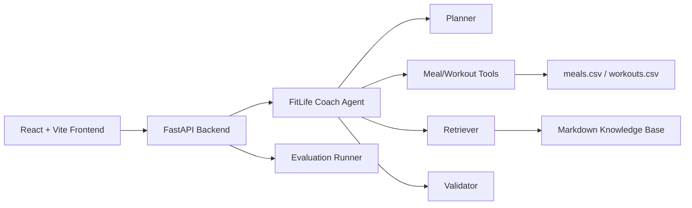

# FitLife Agent

FitLife Agent is an open-source Agentic RAG project for personal fitness and diet management. It combines user profile data, meal records, workout records, a small Markdown knowledge base, deterministic Python analysis tools, a LangGraph-ready agent workflow, FastAPI APIs, and a React + Vite frontend.

The project is designed as a resume-ready AI Agent engineering internship portfolio project. It focuses on a working MVP loop: upload data, analyze records, retrieve knowledge, answer questions, generate weekly reports, generate next-week plans, validate plan safety, and run automated evaluation cases.

## What It Demonstrates

- Agent workflow design with a focused **FitLife Coach Agent**
- RAG over curated Markdown fitness and nutrition documents
- Tool calling with deterministic Python analyzers
- FastAPI backend with typed Pydantic schemas
- React + Vite + TypeScript frontend
- Structured plan validation and automated evaluation
- Docker Compose deployment path

## Architecture



## Agent Workflow

The MVP uses one top-level **FitLife Coach Agent**. Internal graph steps are nodes, not separate agents:

1. Planner classifies the user's intent.
2. Profile Loader reads the local user profile.
3. Data Analyzer calls meal or workout tools when required.
4. Retriever searches knowledge chunks when rules or substitutions are needed.
5. Plan Generator drafts next-week diet and workout plans.
6. Validator checks safety, preferences, allergies, rest days, and structure.
7. Report Writer returns concise Markdown plus trace metadata.

See [docs/AGENT_TERMINOLOGY_AND_DESIGN.md](docs/AGENT_TERMINOLOGY_AND_DESIGN.md) and [UBIQUITOUS_LANGUAGE.md](UBIQUITOUS_LANGUAGE.md) for the project vocabulary and Agent contract.

## Data Formats

`meals.csv` requires:

```text
date,meal,food,amount,calories,protein,carbs,fat
```

`workouts.csv` requires:

```text
date,type,exercise,muscle_group,sets,reps,weight,duration_min
```

`user_profile.json` includes height, weight, age, gender, goal, training frequency, preferences, restrictions, target weight, calorie target, and protein target.

## Local Setup

```bash
python scripts/generate_sample_data.py
python -m venv .venv
.venv\Scripts\python -m pip install -r requirements.txt
.venv\Scripts\python -m uvicorn backend.main:app --reload
```

In another terminal:

```bash
cd frontend
npm install
npm run dev
```

Backend: `http://127.0.0.1:8000`  
Frontend: `http://127.0.0.1:5173`

## Docker

```bash
docker compose up --build
```

## Sample Questions

- 我这周蛋白质吃够了吗？
- 帮我总结这周饮食问题。
- 这周我的训练量相比上周有提升吗？
- 我不想吃鸡胸肉，有什么替代？
- 我想减脂，下周怎么安排训练？

## Evaluation

Run:

```bash
python scripts/run_eval.py --limit 5
```

The evaluation checks tool-call success, retrieval hits, structured Markdown output, keyword coverage, preference compliance, and validator pass rate. Results are written to `backend/data/eval_results.json`.

## Safety Note

FitLife Agent provides general lifestyle management suggestions only. It does not provide medical diagnosis, treatment, injury rehabilitation, or disease-specific diet guidance.

## Resume Description

基于 LangGraph + FastAPI + React 构建 FitLife Agent 个人健身饮食规划智能体，整合用户饮食记录、训练记录和营养知识库，通过 RAG 检索饮食训练规则，并调用 Python 工具完成热量、宏量营养素、训练频率和训练容量分析。系统支持用户画像管理、自然语言问答、周报生成、饮食训练计划生成、计划校验和可视化 Dashboard。前端采用 React + Vite + TypeScript + Tailwind CSS 实现多页面交互界面，后端提供统一 FastAPI 接口，并通过自建评测集验证工具调用成功率、检索命中率和计划校验通过率。
