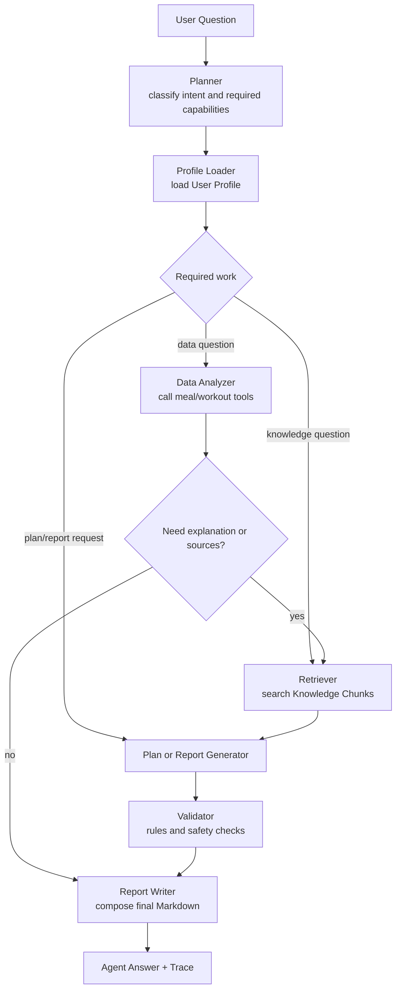

# FitLife Agent Terminology and Agent Design

**Status:** Draft v0.1  
**Date:** 2026-07-01  
**Scope:** Project naming, domain vocabulary, and MVP agent implementation shape following OpenAI agent-building guidance.

## 1. OpenAI Guidance Applied

OpenAI's agent guidance frames an agent as a system where a model uses instructions, context, and tools to accomplish a goal, with guardrails, handoffs, traces, and evaluations added as the workflow becomes more complex. FitLife Agent should follow that model, but stay intentionally small for the MVP.

Official references:

- [OpenAI Agents SDK docs](https://openai.github.io/openai-agents-python/)
- [OpenAI Agents SDK: Agents](https://openai.github.io/openai-agents-python/agents/)
- [OpenAI Agents SDK: Tools](https://openai.github.io/openai-agents-python/tools/)
- [OpenAI Agents SDK: Guardrails](https://openai.github.io/openai-agents-python/guardrails/)
- [OpenAI Agents SDK: Tracing](https://openai.github.io/openai-agents-python/tracing/)
- [OpenAI practical guide to building agents](https://cdn.openai.com/business-guides-and-resources/a-practical-guide-to-building-agents.pdf)

The local implementation may still use LangGraph because the project is designed to show graph orchestration. The OpenAI guidance is used as the product and engineering standard: clear agent contract, focused tools, guardrails, traceability, and evaluation.

## 2. Naming Decisions

### Project Name

Use **FitLife Agent** for the repository, README title, and overall application.

Do not use "FitLife AI", "Fitness Copilot", or "Health Agent" interchangeably. The project needs one memorable name for GitHub and resume use.

### MVP Agent Name

Use **FitLife Coach Agent** for the single top-level MVP agent.

This agent is not a generic chatbot. It is a task-oriented assistant that can:

- inspect the user's query;
- load profile context;
- call deterministic meal and workout analysis tools;
- retrieve fitness and nutrition knowledge;
- draft weekly reports and next-week plans;
- validate plan safety and preference compliance;
- return a Markdown answer with trace metadata.

### Why Single Agent First

OpenAI's agent guidance encourages keeping agents focused and adding orchestration only when the task requires it. For this project, a single top-level agent with explicit graph nodes is the right MVP shape:

- it is easier to explain in README and interviews;
- it keeps evaluation simple because one trace shows the whole route;
- it avoids pretending every internal step is an independent autonomous agent;
- it still demonstrates orchestration through LangGraph nodes and conditional routing.

Split into multiple agents only after the MVP works and the split is justified by different instructions, tool sets, or responsibility boundaries.

## 3. Canonical Agent Contract

The **FitLife Coach Agent** must have a stable contract.

### Inputs

- `question`: user's natural-language question.
- `profile`: loaded from `backend/data/user_profile.json`.
- `meal_records`: loaded from `backend/data/meals.csv` when needed.
- `workout_records`: loaded from `backend/data/workouts.csv` when needed.
- `knowledge_base`: Markdown documents retrieved as source chunks.

### Outputs

- `answer_markdown`: user-facing Markdown answer.
- `intent`: planner classification.
- `tool_calls`: deterministic tools selected and executed.
- `sources`: retrieved knowledge chunks with document names.
- `validation`: pass/fail status, warnings, and repair notes.
- `trace`: compact metadata for debugging and evaluation.

### Non-Goals

- The agent does not diagnose disease.
- The agent does not replace a coach, doctor, or dietitian.
- The agent does not silently invent user data.
- The agent does not make extreme diet or dangerous training recommendations.

## 4. Agent Workflow



This is still one **FitLife Coach Agent**. The boxes are graph nodes, not separate agents.

## 5. Intent Taxonomy

Use these intent names in planner output, tests, eval cases, and traces.

| Intent | Meaning | Typical tools |
| --- | --- | --- |
| `meal_analysis` | User asks about calories, macros, foods, or diet-record patterns. | `analyze_meals`, `load_profile` |
| `workout_analysis` | User asks about training frequency, duration, volume, or muscle coverage. | `analyze_workouts`, `load_profile` |
| `knowledge_qa` | User asks for general fitness or nutrition guidance. | `retrieve_knowledge` |
| `weekly_report` | User asks for a weekly summary across diet and training. | `analyze_meals`, `analyze_workouts`, `retrieve_knowledge` |
| `plan_generation` | User asks for a next-week diet or workout plan. | `load_profile`, `retrieve_knowledge`, `validate_plan` |
| `mixed` | User asks a compound question requiring multiple capabilities. | selected by planner |

Keep intent values stable. They become part of evaluation and interview explanations.

## 6. Tool Inventory

OpenAI's tool guidance treats tools as capabilities the agent can call. In this project, tools should be deterministic Python functions where possible.

| Tool | Purpose | Deterministic | MVP required |
| --- | --- | --- | --- |
| `load_profile` | Load and validate the current user profile. | Yes | Yes |
| `analyze_meals` | Compute daily calories, macros, weekly averages, highest-calorie foods, and target compliance. | Yes | Yes |
| `analyze_workouts` | Compute training frequency, duration, type distribution, volume, and undertrained muscle groups. | Yes | Yes |
| `retrieve_knowledge` | Retrieve knowledge chunks from Markdown documents. | Mostly | Yes |
| `generate_weekly_report` | Create a structured weekly report from analysis outputs. | Yes for MVP fallback | Yes |
| `generate_next_week_plan` | Draft diet and workout plan. | Hybrid | Yes |
| `validate_plan` | Check structure, safety, allergies, preferences, calories, protein target, training frequency, and rest days. | Yes | Yes |
| `run_eval_cases` | Run evaluation cases and aggregate metrics. | Yes | Yes |

Tool design rule: a tool returns structured data, not final prose. The final prose belongs to **Report Writer**.

## 7. Guardrails

Guardrails are first-class product behavior, not README disclaimers only.

### Input Guardrails

- Reject unsupported file types for uploads.
- Reject CSV files with missing required columns.
- Reject nonsensical profile values such as negative weight or impossible age.
- Ask for clarification when a user request depends on missing data.

### Output Guardrails

- Include a general lifestyle disclaimer for personalized plans.
- Do not recommend extreme calorie restriction.
- Do not prescribe medical treatment or injury rehabilitation.
- Do not ignore allergies or dietary restrictions.
- Do not schedule high-intensity training every day.
- Include rest days in generated workout plans.

### Validation Rules

The MVP validator should produce:

```json
{
  "passed": true,
  "warnings": [],
  "violations": [],
  "repair_suggestions": []
}
```

If validation fails, the system should either repair the draft plan or return the answer with visible warnings.

## 8. Trace and Evaluation

OpenAI's tracing and evaluation guidance maps cleanly to this project. Every chat response should include internal trace data that can be hidden from the user interface but used by tests and evaluation.

### Trace Shape

```json
{
  "intent": "meal_analysis",
  "tool_calls": ["load_profile", "analyze_meals"],
  "retrieved_sources": ["nutrition_guidelines.md"],
  "validation_passed": true,
  "warnings": []
}
```

### Evaluation Mapping

Each **Evaluation Case** should assert against trace and final answer:

- expected tool was called;
- expected source document was retrieved when retrieval is required;
- required keywords or sections appear in the answer;
- structured outputs match the expected format;
- validator passes or reports expected warnings;
- preferences and restrictions are respected.

Evaluation is not a judge of "beautiful prose". It is a regression harness for agent routing, tool use, retrieval, structure, and guardrails.

## 9. Prompt and Instruction Boundaries

Keep prompts short and role-specific. The system instruction for **FitLife Coach Agent** should include:

- identity: "You are FitLife Coach Agent";
- scope: fitness and diet planning for general lifestyle management;
- data rule: use tool results and retrieved sources when available;
- safety rule: no medical diagnosis or extreme plans;
- output rule: answer in Markdown with concise sections;
- uncertainty rule: state missing data instead of inventing it.

Do not hide business rules only in a prompt. Any rule that must be reliable belongs in code, tests, or validator logic.

## 10. Landing Strategy for MVP

### Build Order

1. Build deterministic tools and tests before the agent.
2. Build retrieval with source metadata before generative answers.
3. Build planner fallback rules before depending on an LLM key.
4. Build the LangGraph route with trace output.
5. Add generation and validation.
6. Add evaluation cases that lock down expected routes.

### MVP Demo Questions

Use these as the first acceptance questions:

- "我这周蛋白质吃够了吗？"
- "帮我总结这周饮食问题。"
- "这周我的训练量相比上周有提升吗？"
- "我不想吃鸡胸肉，有什么替代？"
- "我想减脂，下周怎么安排训练？"

These five questions cover meal tools, workout tools, retrieval, plan generation, validation, and mixed routing.

## 11. Future Multi-Agent Split

Do not implement these as separate agents in MVP. Treat them as future options:

| Future agent | Split only if |
| --- | --- |
| **Nutrition Analyst Agent** | Meal analysis and nutrition retrieval become complex enough to need a different instruction set. |
| **Training Analyst Agent** | Workout analysis requires separate progression logic and exercise-library reasoning. |
| **Plan Critic Agent** | Validation becomes model-based and needs independent critique before final answer. |
| **Evaluation Agent** | Evaluation grows beyond deterministic checks into LLM-as-judge experiments. |

The future split should preserve the same terms from `UBIQUITOUS_LANGUAGE.md`.

## 12. Decision Summary

- The app is **FitLife Agent**.
- The MVP has one top-level **FitLife Coach Agent**.
- LangGraph nodes are not separate agents.
- Tools are deterministic functions with structured outputs.
- RAG returns cited **Knowledge Chunks**.
- Validation checks one generated output before it reaches the user.
- Evaluation checks many cases after the system runs.
- Trace data is mandatory because it makes agent behavior testable and resume-defensible.
