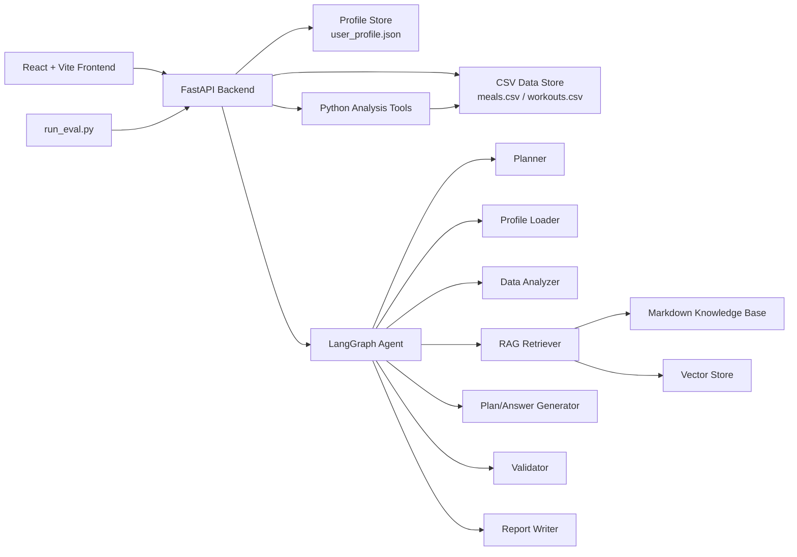

# FitLife Agent Project Spec

**Status:** Draft v0.1  
**Date:** 2026-07-01  
**Target:** Open-source portfolio project for AI Agent engineering internships

## 1. Project Positioning

FitLife Agent is an Agentic RAG application for personal fitness and diet management. The project should demonstrate that the developer can build a practical AI Agent system, not only a chat wrapper:

- use LangGraph to orchestrate multi-step agent workflows;
- use RAG to ground answers in a small fitness and nutrition knowledge base;
- use tool calling to run deterministic Python analysis over user CSV data;
- expose the system through FastAPI APIs;
- provide a React + Vite + TypeScript frontend for upload, profile editing, dashboard, chat, weekly report, plan generation, and evaluation;
- include tests, sample data, evaluation cases, Docker support, and a README that is suitable for GitHub and resumes.

The first release should optimize for a complete, demoable loop rather than breadth. The MVP must let a reviewer run the project locally, load sample data, ask meaningful questions, and see evidence of tool calls, retrieval, validation, and evaluation.

## 2. Open-Source Practice References

Before implementing complex features, use established open-source and official practices where possible:

- **OpenAI agent design:** keep the MVP agent focused, define clear instructions/tools/guardrails, preserve traces, and evaluate behavior with repeatable cases. Project-specific naming and implementation decisions are captured in [AGENT_TERMINOLOGY_AND_DESIGN.md](AGENT_TERMINOLOGY_AND_DESIGN.md) and [../UBIQUITOUS_LANGUAGE.md](../UBIQUITOUS_LANGUAGE.md).
- **LangGraph workflow:** model agent behavior as explicit graph state, nodes, and conditional edges. Use a retriever/tool node instead of hiding retrieval inside a monolithic prompt. Reference: [LangGraph Agentic RAG](https://docs.langchain.com/oss/python/langgraph/agentic-rag), [LangGraph workflows and agents](https://docs.langchain.com/oss/python/langgraph/workflows-agents).
- **LangGraph memory and persistence:** keep MVP state explicit and replaceable. Use local file storage first, then introduce checkpointers or durable stores only when session continuity is required. Reference: [LangGraph memory](https://docs.langchain.com/oss/python/langgraph/add-memory).
- **FastAPI structure:** split larger apps with routers and Pydantic models instead of one large `main.py`. Use `UploadFile` for CSV uploads and typed response models for API contracts. Reference: [FastAPI bigger applications](https://fastapi.tiangolo.com/tutorial/bigger-applications/), [FastAPI request files](https://fastapi.tiangolo.com/tutorial/request-files/), [FastAPI testing](https://fastapi.tiangolo.com/tutorial/testing/).
- **React + Vite:** use the official React plugin and keep API calls, route definitions, reusable components, and domain types separated. Reference: [Vite React plugin](https://github.com/vitejs/vite-plugin-react/tree/main/packages/plugin-react), [Vite guide](https://vite.dev/guide/).

These references shape the project rules below. If implementation discovers a mature open-source pattern that fits better, update this spec before adopting it.

## 3. MVP Definition

### 3.1 MVP Success Criteria

The MVP is done when all of the following are true:

- `backend` starts a FastAPI service with OpenAPI docs.
- `frontend` starts a Vite React app and can call the backend.
- sample data includes at least 30 days of meal records, 4 weeks of workout records, one user profile, five knowledge base Markdown files, and at least 20 evaluation questions.
- the user can upload `meals.csv` and `workouts.csv`.
- the user can edit and save profile data.
- the backend can compute meal and workout analysis through pure Python functions covered by tests.
- the dashboard shows calories, protein, workout counts, workout duration, and trend/chart data.
- the chat endpoint can answer at least five representative questions by combining profile loading, deterministic analysis tools, retrieval, and final answer generation.
- weekly report generation returns structured sections and an actionable checklist.
- plan generation returns a structured diet and workout plan and runs through the validator.
- `run_eval.py` can run the evaluation set and output aggregate metrics.
- README explains architecture, local setup, Docker setup, sample questions, evaluation, and resume wording.

### 3.2 Out of Scope for MVP

- authentication and multi-user accounts;
- mobile app;
- paid deployment;
- wearable device integration;
- medical diagnosis or disease-specific recommendations;
- fully autonomous long-term memory;
- streaming chat unless the MVP is already stable;
- complex database migrations. Local JSON/CSV storage is acceptable for v0.1.

## 4. System Architecture



### Backend

The backend owns data ingestion, deterministic analysis, RAG, agent workflow, validation, and API contracts.

Use this boundary:

- `backend/api/`: HTTP routers only. No heavy business logic.
- `backend/schemas.py`: Pydantic request/response/domain models.
- `backend/tools/`: deterministic, testable analysis functions.
- `backend/rag/`: document loading, chunking, embedding, retrieval, and source metadata.
- `backend/agent/`: LangGraph state, nodes, routing, generation, validation, writer.
- `backend/data/`: local sample/runtime data for MVP.
- `backend/knowledge_base/`: Markdown source documents.

### Frontend

The frontend is a thin client around the backend:

- pages manage layout-level behavior;
- components are reusable UI units;
- hooks handle loading/error/data state;
- `src/services/api.ts` is the only place that knows endpoint URLs;
- `src/types/index.ts` mirrors backend response shapes.

### Storage

For MVP:

- store profile in `backend/data/user_profile.json`;
- store uploaded CSV files in `backend/data/meals.csv` and `backend/data/workouts.csv`;
- store evaluation questions in `backend/data/eval_questions.json`;
- persist vector index under `backend/data/vector_store/` if the selected vector store supports local persistence.

The file-store approach keeps the first version easy to inspect. The code should still isolate storage access so SQLite/PostgreSQL can be added later without rewriting the agent.

## 5. Agent Design

### 5.1 LangGraph State

The graph state should be explicit and serializable:

- `messages`: conversation messages;
- `user_query`: original user question;
- `intent`: planner result, such as `meal_analysis`, `workout_analysis`, `weekly_report`, `plan_generation`, `knowledge_qa`, or `mixed`;
- `profile`: loaded user profile;
- `tool_requests`: selected tool names and arguments;
- `tool_results`: deterministic analysis outputs;
- `retrieval_query`: query used for knowledge retrieval;
- `retrieved_docs`: source snippets and metadata;
- `draft_answer`: generated answer before validation;
- `validation_result`: rule checks and warnings;
- `final_answer`: Markdown response returned to the user;
- `trace`: lightweight debug metadata for evaluation.

### 5.2 Nodes

- **Planner:** classifies intent and selects required tools/retrieval. MVP may use an LLM with a structured Pydantic output; if no API key exists, fall back to keyword rules for demo mode.
- **Profile Loader:** reads `user_profile.json` and normalizes missing optional fields.
- **Data Analyzer:** calls meal/workout tools based on planner output.
- **Retriever:** retrieves source chunks from the Markdown knowledge base.
- **Plan Generator:** creates diet/workout plan drafts when requested.
- **Validator:** checks calorie floor, protein range, allergies/restrictions, training frequency, rest days, and structured output.
- **Report Writer:** composes the final Markdown answer and includes source names/tool trace when useful.

### 5.3 Safety Rules

The agent must not present advice as medical guidance. Answers involving diet/training plans must include a short disclaimer when they are personalized recommendations. The validator must flag:

- obvious starvation diets or calories below a conservative safe floor;
- protein targets disconnected from body weight;
- allergy or restriction violations;
- too many consecutive high-intensity training days;
- missing rest days;
- malformed or incomplete structured plan output.

## 6. API Contract

All API responses use the same envelope:

```json
{
  "success": true,
  "data": {},
  "message": ""
}
```

Errors use:

```json
{
  "success": false,
  "data": null,
  "message": "Human-readable error"
}
```

MVP endpoints:

- `GET /health`
- `GET /dashboard/summary`
- `POST /upload/meals`
- `POST /upload/workouts`
- `GET /profile`
- `POST /profile`
- `POST /chat`
- `POST /report/weekly`
- `POST /plan/generate`
- `POST /eval/run`

## 7. Data Contracts

### Meal CSV

Required columns:

- `date`
- `meal`
- `food`
- `amount`
- `calories`
- `protein`
- `carbs`
- `fat`

### Workout CSV

Required columns:

- `date`
- `type`
- `exercise`
- `muscle_group`
- `sets`
- `reps`
- `weight`
- `duration_min`

### User Profile

Required fields:

- `height_cm`
- `weight_kg`
- `age`
- `gender`
- `goal`
- `weekly_training_frequency`
- `diet_preferences`
- `allergies_or_restrictions`
- `target_weight_kg`
- `daily_calorie_target`
- `daily_protein_target`

## 8. Evaluation Spec

`eval_questions.json` must include at least 20 cases. Each case contains:

- `question`
- `expected_tool`
- `expected_retrieval_doc`
- `expected_answer_format`
- `expected_keywords`

Evaluation metrics:

- tool-call success rate;
- retrieval hit rate;
- structured-output success rate;
- preference compliance rate;
- validator pass rate;
- total pass rate.

The evaluation runner should output both machine-readable JSON and a readable summary.

## 9. Frontend Pages

MVP pages:

- **Dashboard:** summary cards and trend charts.
- **Upload:** meal and workout CSV upload with success/error states.
- **Profile:** editable profile form.
- **Chat:** message list, input box, loading state, error state, Markdown answer rendering.
- **Weekly Report:** one-click report generation and structured display.
- **Plan:** one-click next-week diet/workout plan generation.
- **Evaluation:** evaluation summary and failed case list.

## 10. Quality Bar

### Testing

- unit tests for meal analyzer, workout analyzer, validator, and profile loader;
- API tests for health, upload, profile, dashboard, chat smoke path, report, plan, and eval;
- frontend smoke tests are optional for MVP, but build must pass;
- every deterministic tool should be callable without an LLM.

### Configuration

- API keys live only in `.env`;
- `.env.example` documents required variables;
- the app must have a demo path using sample data;
- errors must be visible but not leak secrets.

### Documentation

README must include:

- project intro and background;
- architecture diagram;
- Agent workflow;
- RAG and tool calling explanation;
- data formats;
- local startup;
- Docker startup;
- sample questions;
- evaluation explanation;
- project highlights;
- resume-ready project description.

## 11. Recommended Repository Structure

```text
fitlife-agent/
  README.md
  .env.example
  docker-compose.yml
  requirements.txt
  backend/
    main.py
    config.py
    schemas.py
    api/
    agent/
    tools/
    rag/
    data/
    knowledge_base/
    tests/
  frontend/
    package.json
    vite.config.ts
    tsconfig.json
    index.html
    src/
      main.tsx
      App.tsx
      routes/
      services/
      types/
      components/
      pages/
      hooks/
      styles/
  scripts/
    generate_sample_data.py
    run_eval.py
  docs/
    PROJECT_SPEC.md
    MVP_IMPLEMENTATION_PLAN.md
```

## 12. Implementation Principles

- Prefer existing library patterns before custom framework code.
- Keep all tool functions deterministic, typed, and independently tested.
- Keep the first vector/RAG implementation small and inspectable.
- Keep the graph explicit enough that the README can show the workflow.
- Treat generated plans as drafts validated by rules, not unquestioned final truth.
- Do not expand scope until the MVP loop is demonstrably working.
