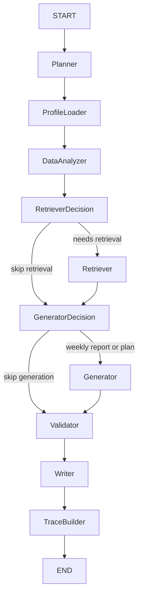

# Task 1: LangGraph Workflow Implementation Plan

**Goal:** Replace the procedural FitLife Coach Agent orchestration with an explicit LangGraph `StateGraph` while preserving the existing `/chat`, evaluation, and trace contracts.

**Scope:** Backend agent workflow only.

**References Used:**

- `docs/PROJECT_SPEC.md`: LangGraph state, node, and trace requirements.
- `docs/AGENT_TERMINOLOGY_AND_DESIGN.md`: canonical node names and single-agent boundary.
- LangGraph official docs: `StateGraph`, `START`, `END`, `add_node`, `add_edge`, `add_conditional_edges`, `compile()`, and `invoke()`.

## Acceptance Criteria

- `build_graph()` compiles a real LangGraph workflow with named nodes for planner, profile loading, analysis, retrieval, report/plan generation, validation, writer, and final trace packaging.
- `run_fitlife_agent(question)` invokes the compiled graph instead of duplicating procedural orchestration.
- Existing response shape remains stable:
  - `answer_markdown`
  - `intent`
  - `trace`
  - `tool_results`
  - `sources`
- Trace remains evaluation-friendly:
  - `trace.intent`
  - `trace.tool_calls`
  - `trace.retrieved_sources`
  - `trace.validation_passed`
  - `trace.warnings`
- Planner routes still trigger the expected tools:
  - meal questions call `load_profile` and `analyze_meals`;
  - knowledge questions call `retrieve_knowledge`;
  - plan questions call `generate_next_week_plan` and `validate_plan`;
  - weekly report questions call meal analysis, workout analysis, retrieval, and report generation.
- No OpenAI API integration, embedding/vector RAG migration, or frontend trace UI changes in this task.

## Files

- Modify: `backend/agent/state.py`
  - Keep `AgentState` serializable and add fields needed by graph routing.
- Modify: `backend/agent/graph.py`
  - Implement graph nodes and conditional routing.
  - Keep `run_fitlife_agent(question: str) -> dict` public API stable.
- Create: `backend/tests/test_agent_graph.py`
  - Lock down real graph execution, routing, trace, and returned response shape.
- Create: `docs/TASK_1_LANGGRAPH_WORKFLOW_PLAN.md`
  - Record task decomposition and verification path.

## TDD Steps

1. Add graph workflow tests in `backend/tests/test_agent_graph.py`.
2. Run only the new tests and confirm they fail because the current graph is too shallow or `run_fitlife_agent` does not use the graph.
3. Implement minimal graph state and node orchestration.
4. Run the new tests until they pass.
5. Run all backend tests.
6. Run eval smoke with `scripts/run_eval.py --limit 5`.
7. Commit the task branch and push it to `origin/feat/langgraph-workflow`.

## Graph Shape



## Verification Commands

```powershell
..\..\.venv\Scripts\python -m pytest backend\tests\test_agent_graph.py -q -p no:cacheprovider
..\..\.venv\Scripts\python -m pytest backend\tests -q -p no:cacheprovider
..\..\.venv\Scripts\python scripts\run_eval.py --limit 5
```
